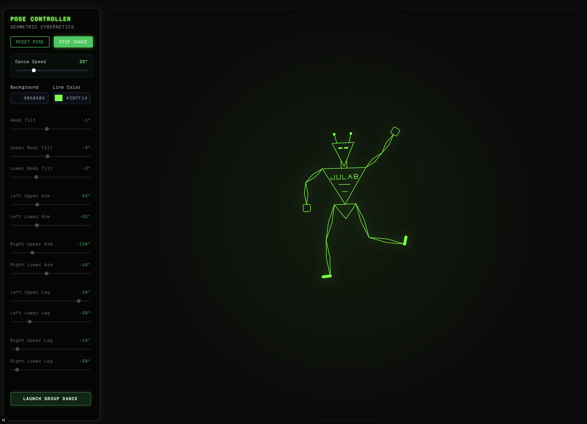
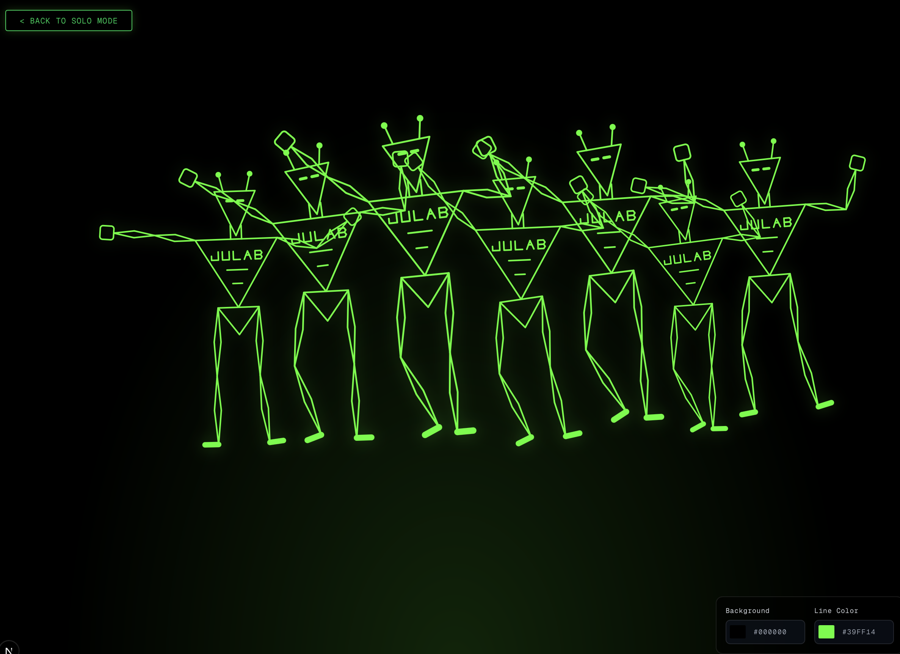

# Dancing Robots

This is a personal project to create a dancing robot on a website that has the option to natively move its individual body parts. 

## How to run the program
To start the website locally, run the following command in your terminal:

```bash
npm install
npm run dev
```

This will start the website on your local computer. On the first page, there is a single robot. You can manually tweak its pose using the sliders, or you can check the "Dance Mode" box to watch it groove. There is also a second webpage (the Group Dance page) that features a crowd of robots all doing exactly the same dance sequence together.



---

## Code Breakdown

Below is an overview of how the project is structured and how everything works inside the `src` folder.

### 1. How the robot is built (`src/components/RobotDancer.tsx`)
The robot is built entirely using raw, hard-coded SVG lines and polygons.

The key to making the robot move correctly without falling apart is that all body parts are mathematically nested, for example:
- The hand is nested inside the lower arm.
- The lower arm is nested inside the upper arm.
- The upper arm is attached to the shoulder on the torso.

Because of this hierarchy, rotating a higher-level body part (like the torso) automatically moves everything attached to it.
To make this work cleanly, these is a custom `<RotateGroup />` helper component. By simply passing in angles (like `leftLowerArmAngle={45}`), the SVG pivots that specific shape exactly around its joint.


### 2. How the Dancing Animation works
The animation system is driven entirely by math inside a standard `useEffect` hook.

The process works as follows:
1. Every few seconds (based on the selected Dance Speed), a new target angle is randomly generated for each joint. Most poses are fairly normal, but there’s a small chance of generating an exaggerated or chaotic pose.
2. The browser’s built-in `requestAnimationFrame` runs the animation loop at roughly 60 frames per second.
3. On every frame, a technique called linear interpolation (lerp) moves each joint about 1% closer to its target angle. Because each movement slows down as it approaches its target, the result is a smooth, organic animation that feels fluid.
4. Finally, to keep the robot feeling "alive" even when it's mostly standing still, a fast oscillating sine wave (`Math.sin()`) is continuously added to every joint. This creates a subtle, constant breathinmotion stacked on top of the slow, sweeping dance moves.

### 3. The Pages (`src/app/page.tsx`)
The main page contains all UI elements (sliders, color pickers, toggles) as well as the React state for all 11 robot joints.
When a slider is adjusted, the corresponding state updates immediately, which directly updates the SVG and changes the robot’s pose in real time.
### 4. The Group Wave (`src/app/group/page.tsx`)
The second webpage shows a crowd of robots. 
Instead of writing separate animation logic, the page simply renders multiple smaller `<CyberRobot />`components that all follow the same dance algorithm.
To create the wave-like effect, the animation uses a pseudo-random function based on time rather than true randomness. By slightly offsetting the time value for each robot (for example, delaying Robot #2 by 500ms), every robot performs the exact same dance sequence — just shifted in time — resulting in a synchronized but flowing group animation.
